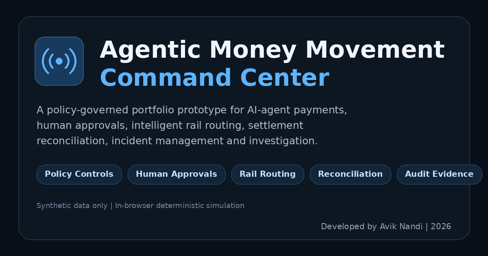
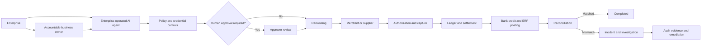

# Agentic Money Movement Command Center

[](https://github.com/avikcincy-sanju/agentic-money-movement-command-center/actions/workflows/ci.yml)
[](https://github.com/avikcincy-sanju/agentic-money-movement-command-center/actions/workflows/deploy.yml)
[](LICENSE)

A policy-governed control plane and operational digital twin for AI-agent-initiated payments—from intent and authorization through rail selection, settlement, reconciliation, incident response, and evidence-grounded investigation.

**Live demo:**  
https://avikcincy-sanju.github.io/agentic-money-movement-command-center/



> **Portfolio status:** This is a tested, production-ready portfolio prototype—not a production payment platform.
>
> **Synthetic environment:** The application does not connect to a real payment processor, bank, blockchain, accounting ledger, ERP, identity provider, or external LLM. It executes policy, routing, lifecycle, exception, approval, and investigation logic against fictional identities, counterparties, transactions, credentials, and financial-system events.

---

## Product thesis

Most agentic-commerce demos stop when an AI agent completes a purchase. Most payment-operations dashboards begin only after a processor creates a transaction.

This prototype connects both sides:

```text
Agent intent
  → policy and credential evaluation
  → human approval when required
  → multi-rail scoring and selection
  → authorization and capture
  → ledger posting and settlement
  → bank credit and ERP posting
  → reconciliation
  → incident investigation
  → audit evidence
```

The goal is **intent-to-reconciliation traceability**: preserving who or what requested a payment, what the agent was authorized to do, why a payment rail was selected, what happened downstream, whether the expected financial outcome matched the actual outcome, and who must act when it did not.

---

## System model



The Agent Registry represents **enterprise-operated software agents**. The listed people are fictional accountable business owners responsible for governance and oversight. Merchants and suppliers are separate external counterparties that receive payment.

---

## Working capabilities

### Agent Registry

Three enterprise-operated AI agents demonstrate distinct use cases:

- Cloud and SaaS procurement
- Employee travel booking
- Approved supplier payments

Each agent has:

- An accountable business owner and operating function
- A delegated per-transaction limit
- A delegated daily budget
- Permitted spending categories
- Permitted transaction countries
- Authorized payment rails
- A credential expiration date and derived credential status
- Optional mandatory human-review behavior

Credential status is calculated from the expiration date and can resolve to:

- `Valid`
- `Expiring Soon`
- `Expired`

### Policy Control Center

Six runtime policies govern agent behavior:

1. Maximum transaction value
2. Human approval threshold
3. Merchant-category allowlist
4. Daily velocity limit
5. Geographic restriction
6. Stablecoin minimum-savings eligibility

Disabling a policy changes the actual decision path. Scenario names do not hard-code outcomes; requests proceed whenever the active rules permit them.

### Human approvals

Requests at or above the configured approval threshold—or requests from agents configured for mandatory review—pause before routing.

An approver can:

- Approve the original request
- Modify and approve the request
- Reject the request

Modified requests are revalidated against the current hard controls before funds are allowed to move. Invalid modifications remain pending and generate audit evidence.

### Intelligent routing

Card, ACH, RTP, and stablecoin rails are evaluated using:

- Estimated all-in cost
- Completion deadline and rail speed
- Settlement certainty
- Counterparty acceptance
- Fraud risk
- Reversibility
- Agent rail credentials
- Configurable stablecoin savings threshold

The routing engine records why a rail was selected and why alternatives were rejected.

### Operational digital twin

Approved transactions progress through ten observable stages:

```text
intent
→ policy validation
→ credential provisioning
→ authorization
→ capture
→ ledger posting
→ settlement
→ bank credit
→ ERP posting
→ reconciliation
```

Each stage generates evidence in the Audit Trail.

### Settlement exception management

The settlement-mismatch scenario retains both:

- Expected merchant settlement from the processor settlement record
- Actual bank credit

The application calculates the exact reconciliation difference, creates an operational incident, identifies affected systems, proposes a probable cause, recommends an accountable team, and records corrective actions.

Routing failures can also create incidents when no permitted rail can satisfy the request.

### Investigation Copilot

The deterministic Investigation Copilot answers questions about:

- Authorization and policy outcomes
- Approval status
- Rail selection
- Current money location
- Settlement shortfalls
- Operational ownership
- Recommended remediation

Responses are derived from the in-memory transaction, approval, incident, routing, and audit-event data. Answers cite actual `evt-...` records from the Audit Trail rather than inventing unsupported evidence.

### Incident management

Incidents include:

- Severity
- Status
- Financial exposure
- Affected systems
- Probable cause
- Recommended action
- Suggested operational owner
- Linked audit evidence

Resolving an incident creates a new Audit Trail event. Duplicate resolution actions do not create duplicate evidence.

### Resettable demo environment

The **Reset demo data** control restores the original synthetic environment without requiring a browser refresh. It clears:

- Transactions
- Approvals
- Incidents
- Audit events
- Policy changes
- Copilot history
- Agent daily-spend changes
- Scenario state

The user is returned to the Overview screen after confirmation.

---

## What is real versus simulated

| Real application logic | Simulated infrastructure |
|---|---|
| Agent and credential configuration | External identity, KYC, and KYB systems |
| Runtime policy evaluation | Payment processor connectivity |
| Human approval and hard-control revalidation | Card, ACH, RTP, and blockchain networks |
| Cost-, risk-, and deadline-aware rail scoring | Real authorization and settlement timing |
| Transaction lifecycle state generation | Production accounting ledger |
| Fee and expected-versus-actual settlement calculations | Bank and ERP connectivity |
| Incident detection and exposure calculation | Real funds movement |
| Audit-event-grounded investigation responses | External hosted LLM |
| Date-derived credential status | Real credential issuer |
| Input and scenario hardening | Production fraud and security controls |

---

## Demo scenarios

### 1. Clean approval

A compliant request:

- Passes all active policies
- Receives a route decision
- Completes the ten-stage lifecycle
- Reconciles successfully

### 2. Policy violation

The scenario generates an amount dynamically above the selected agent's transaction limit.

An out-of-policy amount, category, country, credential, or daily-velocity request is stopped before funds move. Disable the relevant policy and rerun the request to demonstrate how the active control set changes the outcome.

### 3. Settlement mismatch

The payment authorizes and captures successfully, but the bank credits less than the processor settlement record indicates.

Reconciliation:

- Calculates the exact shortfall
- Marks the transaction as an exception
- Opens an incident
- Identifies the affected systems
- Recommends investigation and remediation steps
- Preserves supporting evidence in the Audit Trail

---

## Input and scenario hardening

The prototype includes safeguards against invalid or misleading demo states:

- Transaction amount must be finite and at least `$0.01`
- Zero, negative, `NaN`, and infinite amounts are rejected
- Amount validation is enforced in both the interface and business logic
- Agent changes restore valid defaults for category, merchant, country, deadline, and amount
- Scenario changes clear stale results and restore scenario-appropriate defaults
- Editing a submitted request clears the previous decision
- Policy-violation amounts are calculated from each selected agent's limit
- Credential state is derived from the credential expiration date
- Approval modifications are revalidated against current controls
- Duplicate incident-resolution actions are prevented

---

## Suggested demonstration flow

A concise walkthrough for interviews or product discussions:

1. Open **Agent Registry** and explain enterprise-operated agents, accountable owners, and delegated authority.
2. Open **Policy Control Center** and show the six runtime controls.
3. Run a **Clean approval** request and review the selected rail.
4. Open **Transactions** and follow the ten-stage lifecycle.
5. Run a request requiring **Human approval**.
6. Modify the amount above a hard limit and show that approval is blocked.
7. Run a **Policy violation** request and confirm no funds move.
8. Disable the relevant policy and rerun the same request.
9. Run a **Settlement mismatch** and inspect the exact financial exposure.
10. Ask the **Investigation Copilot** where the money is and whether the merchant is still owed funds.
11. Resolve the incident and verify the resolution event in **Audit Trail**.
12. Use **Reset demo data** to restore the original environment.

---

## Project structure

```text
.
├── .github/
│   └── workflows/
│       ├── ci.yml                 Continuous integration
│       └── deploy.yml             GitHub Pages deployment
├── public/
│   └── preview.png                Social-sharing preview image
├── src/
│   ├── components/                Product screens and operator workflows
│   ├── data/
│   │   └── seed.ts                Synthetic agents, policies, counterparties, and rail economics
│   ├── engine/                    Policy, routing, lifecycle, incident, and copilot logic
│   │   └── __tests__/             Engine and audit-hardening automated tests
│   ├── lib/
│   │   ├── scenario.ts            Agent-specific scenario defaults and test configuration
│   │   └── store.tsx              State, approvals, incidents, resets, and audit orchestration
│   ├── types/                     Domain models
│   ├── App.tsx                    Application shell and navigation
│   └── index.css                  Global design system and responsive behavior
├── CONTRIBUTING.md                Contribution guidance
├── LICENSE                        MIT License
├── README.md                      Project documentation
├── package.json                   Scripts and dependencies
├── vite.config.ts                 Vite and GitHub Pages configuration
└── .nvmrc                         Supported Node.js version
```

The `engine/` layer is plain TypeScript without React dependencies, allowing the core decision logic to be tested independently from the interface.

---

## Technology

- React
- TypeScript
- Vite
- Tailwind CSS
- Vitest
- GitHub Actions
- GitHub Pages

---

## Run locally

### Prerequisites

- Node.js 22
- npm

The repository includes an `.nvmrc` file:

```bash
nvm use
```

Install dependencies and start the development server:

```bash
npm ci
npm run dev
```

Open the local URL displayed by Vite.

---

## Validate the project

Run the complete technical gate:

```bash
npm ci
npm run lint
npm test
npm run build
npm audit --audit-level=high
```

The automated test suite covers:

- Positive and finite amount validation
- Policy decisions
- Hard-control revalidation
- Category and geography restrictions
- Daily velocity limits
- Date-derived credential status
- Deadline and rail eligibility
- Stablecoin savings-policy behavior
- Dynamic agent-specific scenario amounts
- Expected-versus-actual settlement
- Routing failures
- Incident creation and resolution
- Copilot evidence grounding
- Audit Trail citations

The GitHub Actions CI workflow runs linting, tests, and the production build for changes pushed to the repository.

---

## Deploy to GitHub Pages

The repository includes `.github/workflows/deploy.yml`.

1. Create or use a public GitHub repository named `agentic-money-movement-command-center`.
2. Push the project to the repository's `main` branch.
3. Open **Settings → Pages**.
4. Under **Build and deployment**, select **GitHub Actions**.
5. Confirm that the deployment workflow completes successfully.
6. Open:

```text
https://avikcincy-sanju.github.io/agentic-money-movement-command-center/
```

When using a different repository name, update:

- `base` in `vite.config.ts`
- `homepage` in `package.json`
- `repository.url` in `package.json`
- Any hard-coded social-preview URLs in `index.html`

---

## Security and privacy

This repository is designed for public portfolio use.

It should contain only:

- Synthetic identities
- Fictional merchants and suppliers
- Synthetic transactions and events
- Demonstration credentials
- Public source code and documentation

It must not contain:

- API keys or access tokens
- Passwords or private certificates
- Real payment credentials
- Real customer or employee data
- Employer-confidential information
- Internal company URLs or documents
- Production account identifiers

Before publishing changes, search for accidental sensitive content and review the production bundle.

---

## Accessibility and responsive behavior

The interface includes:

- Keyboard-visible focus states
- Active-page navigation semantics
- Labels and helper text for form controls
- Status text in addition to status colors
- Reduced-motion support
- Responsive navigation for smaller screens
- Horizontally scrollable data-heavy views where needed

The primary presentation experience remains optimized for desktop demonstrations.

---

## Current limitations

- Application state is intentionally stored in browser memory only. Refreshing the page or using **Reset demo data** restores the original synthetic environment.
- All external financial systems and network interactions are simulated.
- The Investigation Copilot is a deterministic evidence router, not a hosted generative-AI service.
- Authentication and production-grade role-based access control are not implemented.
- Lifecycle timestamps are compressed for demonstration purposes.
- There is no durable database, event bus, processor integration, or real funds movement.
- Financial calculations and operational recommendations are illustrative and should not be treated as production accounting, legal, compliance, or risk decisions.
- The prototype has not undergone formal penetration testing, regulatory certification, or production operational-readiness review.

---

## Potential next steps

- Persist agents, policies, transactions, approvals, incidents, and audit events in Supabase or another durable data store.
- Add authenticated operator, approver, auditor, and administrator roles.
- Add maker-checker controls and separation of duties.
- Connect the Copilot to a server-side LLM while preserving transaction-scoped audit citations.
- Add sandbox connectors for a payment processor, bank simulator, accounting platform, or stablecoin testnet.
- Add webhook ingestion and asynchronous event processing.
- Export an investigation package containing transaction evidence, incident history, and remediation actions.
- Add configurable policy authoring and version history.
- Add browser-based end-to-end and accessibility tests.
- Add multi-currency, FX, refunds, reversals, disputes, chargebacks, and partial-settlement scenarios.
- Add policy simulation before activation and approval workflows for policy changes.
- Add durable observability, metrics, alerts, and operational service-level objectives.

---

## Contributing

Contributions, issues, and improvement ideas are welcome. See [CONTRIBUTING.md](CONTRIBUTING.md) for development and validation guidance.

---

## License

This project is available under the [MIT License](LICENSE).

The license permits reuse, modification, distribution, and commercial use while requiring preservation of the copyright and license notice. The software is provided without warranty.

Copyright © 2026 Avik Nandi.

---

## Author

**Avik Nandi**

Payments, agentic commerce, financial infrastructure, and product strategy.

- Live prototype: [Agentic Money Movement Command Center](https://avikcincy-sanju.github.io/agentic-money-movement-command-center/)

---

## Disclaimer

This project is an independent portfolio prototype. References to payment methods, operating models, or financial-infrastructure concepts are illustrative. The project is not affiliated with or endorsed by any payment network, bank, processor, merchant, supplier, employer, or other third party.
